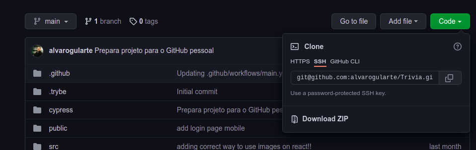
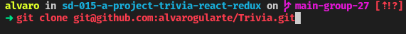
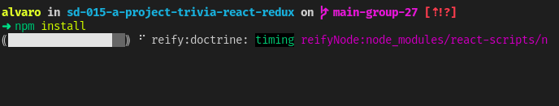

# **Descrição do projeto**
Este projeto foi desenvolvido como um jogo de perguntas e respostas baseado no jogo Trivia (tipo um show do milhão americano rs) utilizando React e Redux. O desenvolvimento foi realizado em grupo utilizando um quadro Kanban para a divisão das funcionalidades a serem desenvolvidas.

# **Como instalar**
Primeiramente é necessário realizar o clone deste repositório (você pode copiar o SSH e depois rodar o comando `git clone` + código SSH).

Em seguida, você deverá instalar as dependencias utilizando o comando `npm install`

Pronto, agora só resta rodar o `npm start` e se **divertir** com o Trivia!!!

# **Imagens do projeto em funcionamento**

