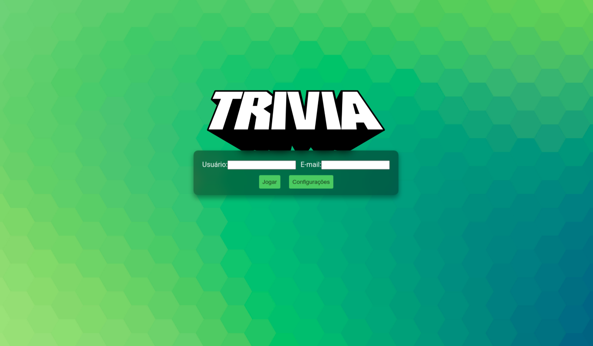
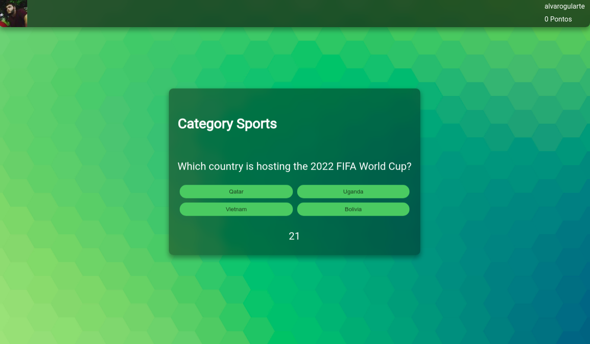
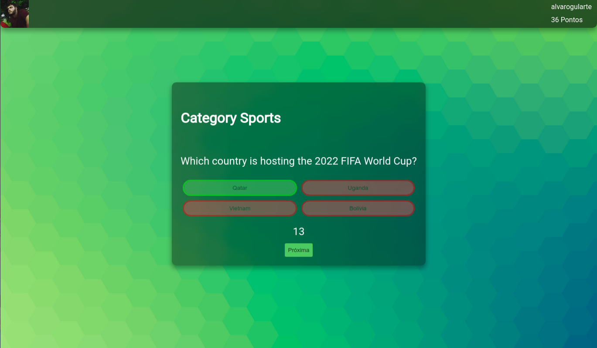
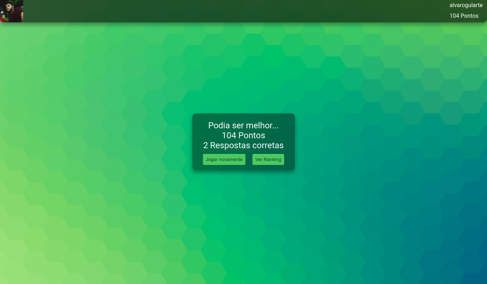
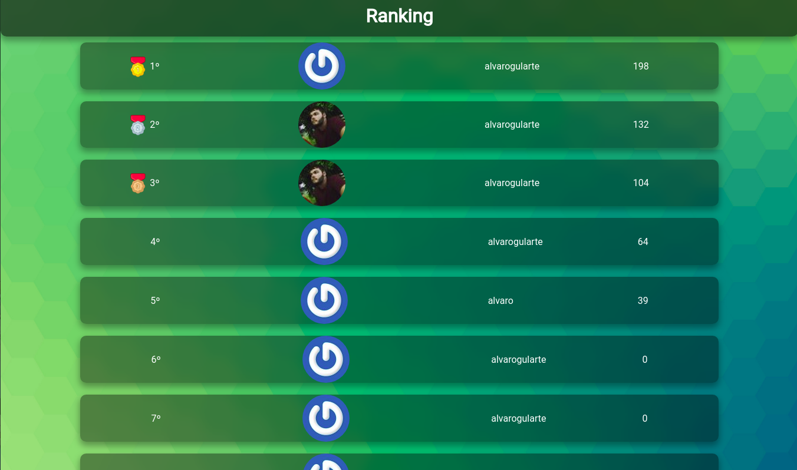

# Descrição do projeto
Este projeto foi desenvolvido como um jogo de perguntas e respostas baseado no jogo Trivia (tipo um show do milhão americano). O desenvolvimento foi realizado em grupo utilizando um quadro Kanban para a divisão das funcionalidades a serem desenvolvidas.

## Tecnologias utilizadas
- React
- Redux
- HTML5
- CSS3
- ES6
## Instalando dependências
Primeiramente é necessário realizar o clone deste repositório:
```bash
git clone git@github.com:alvarogularte/Trivia.git
```

Em seguida, você deverá instalar as dependencias utilizando o comando:
```bash
npm install
```

Pronto, agora só resta rodar:
```bash
npm start
```
e se **divertir** com o Trivia!!!

## Imagens do projeto em funcionamento







